  

  

  
  
  

 

## 👋 Sobre mí

Soy **Ingeniero de Software** especializado en **desarrollo Frontend con Angular** y en **Ingeniería de Datos**. Me gusta estar en los dos extremos del producto: construir interfaces claras y rápidas, y diseñar el flujo de datos que las alimenta, desde la base de datos hasta el dashboard.

  

 

## 🧰 Tecnologías

<table align="center">
  <tr>
    <td align="center" width="50%"><b>🎨 Frontend</b></td>
    <td align="center" width="50%"><b>🗄️ Datos & BI</b></td>
  </tr>
  <tr>
    <td align="center">
      
    </td>
    <td align="center">
       
      
      
      
      
    </td>
  </tr>
  <tr>
    <td align="center" width="50%"><b>⚙️ Backend</b></td>
    <td align="center" width="50%"><b>🛠️ Herramientas</b></td>
  </tr>
  <tr>
    <td align="center">
      
    </td>
    <td align="center">
      
    </td>
  </tr>
</table>

 

  <picture>
    <source media="(prefers-color-scheme: dark)" srcset="https://raw.githubusercontent.com/AngeloVaca/AngeloVaca/output/github-snake-dark.svg" />
    <source media="(prefers-color-scheme: light)" srcset="https://raw.githubusercontent.com/AngeloVaca/AngeloVaca/output/github-snake.svg" />
    
  </picture>

  

